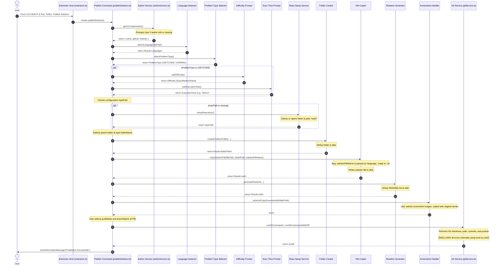
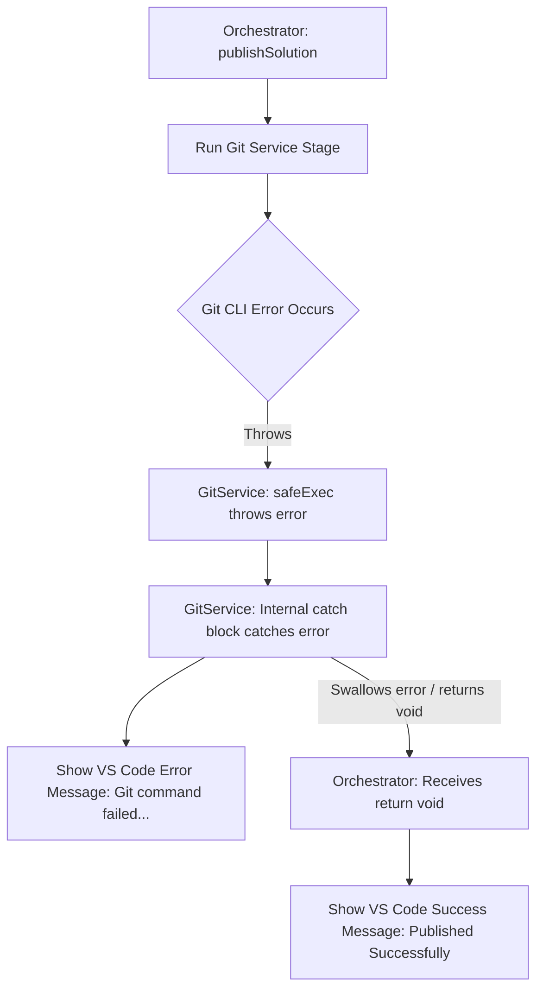

# GitGo Architecture & Capability Audit Report

This report provides a comprehensive, evidence-based architectural audit of the **GitGo** VS Code extension based directly on the source code in the `c:\Github\GitGo` workspace.

---

## Section 1 — Executive Summary

### Project Purpose
GitGo is designed to automate the publishing and documentation of coding solutions (LeetCode or general programs) directly from VS Code to a GitHub repository with a single command. It handles directory setup, code file copying, README formatting, screenshot uploading, and Git syncing (push or pull request).

### Current Maturity Level
* **Maturity**: Pre-Production / Prototype.
* While the core functionality of creating folders and running git commands is written, the extension has several critical structural bugs, hardcoded defaults, silent error swallows, and dead code that prevent it from being production-ready.

### Current Architecture Style
* **Procedural Orchestration**: Main orchestrator [publishSolution.ts](file:///c:/Github/GitGo/src/commands/publishSolution.ts) acts as a controller, invoking independent helper services in `src/services/` synchronously or asynchronously.
* The codebase contributes a modular structure (functions separated into distinct files), but lacks formal interfaces, type safety for configurations, or a robust transactional model.

### Current Implementation Completeness
* **Partially Complete**: Most features documented in the README (such as README generation, git push, and screenshot handling) exist in the source code but fail under common edge cases (such as when the default branch is not `main`, or when users cancel inputs).

### Major Strengths
* **Separation of Concerns**: Each step in the pipeline (e.g. language detection, readme creation, difficulty prompting) resides in its own isolated utility file in `src/services/`.
* **Standardized Formatting**: Provides automated markdown templates matching problem types.

### Major Weaknesses
1. **Premature Success Messages**: Git errors are swallowed inside the `gitService.ts` methods, so the orchestrator shows "Published Successfully" even after a git checkout or push failure.
2. **Hardcoded Defaults**: Git branch commands assume a default branch named `main` when local HEAD references are missing or during repository setup.
3. **Invalid Copy File Parameter**: The file copier expects a language string (e.g. `"Java"`), but the orchestrator passes a filename (e.g. `"Solution.java"`), causing all copied files to default to `.txt` extensions.
4. **Mismatched Screenshot Names**: The screenshot handler copies images under their original basenames, but the README templates hardcode reference links to `testcases.png` and `submission.png`, resulting in broken images.
5. **Dead Code**: Several model interfaces (`Problem`, `PublishPlan`, `RepositoryContext`) and template loaders are completely unused.

---

## Section 2 — Full File Tree Analysis

### Complete Project Structure (under `src/`)

```text
src/
├── commands/
│   ├── changeRepository.ts
│   └── publishSolution.ts
├── domain/
│   ├── Author.ts
│   ├── Problem.ts
│   ├── PublishPlan.ts
│   ├── RepositoryContext.ts
│   └── Result.ts
├── services/
│   ├── authorService.ts
│   ├── branchNamePrompt.ts
│   ├── defaultBranchDetector.ts
│   ├── difficultyPrompt.ts
│   ├── executionTimePrompt.ts
│   ├── fileCopier.ts
│   ├── folderCreator.ts
│   ├── gitService.ts
│   ├── languageDetector.ts
│   ├── parentFolderSelector.ts
│   ├── prDescriptionGenerator.ts
│   ├── problemTypeSelector.ts
│   ├── pushModeSelector.ts
│   ├── readmeGenerator.ts
│   ├── repoInfoService.ts
│   ├── repoSetupService.ts
│   ├── screenshotHandler.ts
│   ├── solutionFileNameResolver.ts
│   └── templateLoader.ts
├── templates/
│   ├── leetcodeReadme.ts
│   └── normalReadme.ts
├── types/
│   ├── problemType.ts
│   └── pushMode.ts
└── extension.ts
```

### File-by-File Audit

#### 1. [extension.ts](file:///c:/Github/GitGo/src/extension.ts)
* **Purpose**: VS Code Extension entry point.
* **Responsibilities**: Registers commands `gitgo.publishSolution` and `gitgo.changeRepository` on activation.
* **Dependencies**: `vscode`, `publishSolution`, `changeRepository`
* **Used / Dead**: Actively used. No dead code.

#### 2. [src/commands/publishSolution.ts](file:///c:/Github/GitGo/src/commands/publishSolution.ts)
* **Purpose**: Coordinates the publishing pipeline.
* **Responsibilities**: Invokes prompts, collects inputs, prepares folders, generates READMEs, copies files, triggers git.
* **Dependencies**: `vscode`, various services.
* **Used / Dead**: Actively used. Main entry point.

#### 3. [src/commands/changeRepository.ts](file:///c:/Github/GitGo/src/commands/changeRepository.ts)
* **Purpose**: Configures/switches target repository directory.
* **Responsibilities**: Triggers setup wizard and updates settings configuration.
* **Dependencies**: `vscode`, `repoSetupService`
* **Used / Dead**: Actively used.

#### 4. [src/domain/Author.ts](file:///c:/Github/GitGo/src/domain/Author.ts)
* **Purpose**: Schema type for Author metadata.
* **Responsibilities**: Defines `name`, `github`, `linkedin` structures.
* **Dependencies**: None.
* **Used / Dead**: Actively used by `authorService.ts` and `readmeGenerator.ts`.

#### 5. [src/domain/Problem.ts](file:///c:/Github/GitGo/src/domain/Problem.ts)
* **Purpose**: Schema type for Problem metadata.
* **Responsibilities**: Defines difficulty, language, type, executionTime.
* **Dependencies**: None.
* **Used / Dead**: **DEAD CODE**. Only imported by `PublishPlan.ts` which is itself dead code.

#### 6. [src/domain/PublishPlan.ts](file:///c:/Github/GitGo/src/domain/PublishPlan.ts)
* **Purpose**: Schema type representing the pipeline plan.
* **Responsibilities**: Defines files, folders, and push options.
* **Dependencies**: `Problem`
* **Used / Dead**: **DEAD CODE**. Never used in any active script.

#### 7. [src/domain/RepositoryContext.ts](file:///c:/Github/GitGo/src/domain/RepositoryContext.ts)
* **Purpose**: Schema type for repo state.
* **Responsibilities**: Defines path, branch, name, and owner.
* **Dependencies**: None.
* **Used / Dead**: **DEAD CODE**. Never used in any active script.

#### 8. [src/domain/Result.ts](file:///c:/Github/GitGo/src/domain/Result.ts)
* **Purpose**: Unifies function return values (success/failure wrapping).
* **Responsibilities**: Defines `{ ok: true, data } | { ok: false, errorType, message }`.
* **Dependencies**: None.
* **Used / Dead**: Actively used across services.

#### 9. [src/services/authorService.ts](file:///c:/Github/GitGo/src/services/authorService.ts)
* **Purpose**: Retrieves or prompts for author metadata.
* **Responsibilities**: Reads VS Code configuration and writes missing settings globally.
* **Dependencies**: `vscode`, `Author`
* **Used / Dead**: Actively used.

#### 10. [src/services/branchNamePrompt.ts](file:///c:/Github/GitGo/src/services/branchNamePrompt.ts)
* **Purpose**: Prompt for Git branch name.
* **Responsibilities**: Displays text input for feature branches.
* **Dependencies**: `vscode`
* **Used / Dead**: Actively used in PR push mode.

#### 11. [src/services/defaultBranchDetector.ts](file:///c:/Github/GitGo/src/services/defaultBranchDetector.ts)
* **Purpose**: Detects repo default branch.
* **Responsibilities**: Runs shell command `git symbolic-ref refs/remotes/origin/HEAD`.
* **Dependencies**: `child_process`
* **Used / Dead**: Actively used in git operations.

#### 12. [src/services/difficultyPrompt.ts](file:///c:/Github/GitGo/src/services/difficultyPrompt.ts)
* **Purpose**: Prompts for LeetCode difficulty.
* **Responsibilities**: Shows a quick pick selection dialog.
* **Dependencies**: `vscode`
* **Used / Dead**: Actively used.

#### 13. [src/services/executionTimePrompt.ts](file:///c:/Github/GitGo/src/services/executionTimePrompt.ts)
* **Purpose**: Prompts for LeetCode execution time.
* **Responsibilities**: Shows input box, validates input is not empty.
* **Dependencies**: `vscode`
* **Used / Dead**: Actively used.

#### 14. [src/services/fileCopier.ts](file:///c:/Github/GitGo/src/services/fileCopier.ts)
* **Purpose**: Copies the source solution file to the target problem folder.
* **Responsibilities**: Copies file to destination.
* **Dependencies**: `fs`, `path`, `Result`
* **Used / Dead**: Actively used, but contains a bug causing file extension to always map to `.txt`.

#### 15. [src/services/folderCreator.ts](file:///c:/Github/GitGo/src/services/folderCreator.ts)
* **Purpose**: Prepares target folders on the disk.
* **Responsibilities**: Creates directories recursively.
* **Dependencies**: `fs`, `path`, `Result`
* **Used / Dead**: Actively used.

#### 16. [src/services/gitService.ts](file:///c:/Github/GitGo/src/services/gitService.ts)
* **Purpose**: Handles Git CLI automation.
* **Responsibilities**: Performs branch switches, commits, pushes, and triggers PR web pages.
* **Dependencies**: `child_process`, `vscode`, `defaultBranchDetector`, `repoInfoService`, `prDescriptionGenerator`
* **Used / Dead**: Actively used, but swallows errors internally.

#### 17. [src/services/languageDetector.ts](file:///c:/Github/GitGo/src/services/languageDetector.ts)
* **Purpose**: Resolves language from document extensions.
* **Responsibilities**: Matches file extension (e.g. `.py`) to full name (e.g. `"Python"`).
* **Dependencies**: `path`, `Result`
* **Used / Dead**: Actively used.

#### 18. [src/services/parentFolderSelector.ts](file:///c:/Github/GitGo/src/services/parentFolderSelector.ts)
* **Purpose**: Navigates workspace directories.
* **Responsibilities**: Recursively queries files and lets users pick a parent directory.
* **Dependencies**: `vscode`, `fs`, `path`
* **Used / Dead**: Actively used.

#### 19. [src/services/prDescriptionGenerator.ts](file:///c:/Github/GitGo/src/services/prDescriptionGenerator.ts)
* **Purpose**: Generates PR descriptions.
* **Responsibilities**: Generates structured markdown text with stats.
* **Dependencies**: None.
* **Used / Dead**: Actively used in PR mode.

#### 20. [src/services/problemTypeSelector.ts](file:///c:/Github/GitGo/src/services/problemTypeSelector.ts)
* **Purpose**: Selection dialog for problem type.
* **Responsibilities**: Prompts between LeetCode and Normal.
* **Dependencies**: `vscode`, `ProblemType`
* **Used / Dead**: Actively used.

#### 21. [src/services/pushModeSelector.ts](file:///c:/Github/GitGo/src/services/pushModeSelector.ts)
* **Purpose**: Selection dialog for push mode.
* **Responsibilities**: Prompts between Normal Push and Pull Request.
* **Dependencies**: `vscode`, `PushMode`
* **Used / Dead**: Actively used.

#### 22. [src/services/readmeGenerator.ts](file:///c:/Github/GitGo/src/services/readmeGenerator.ts)
* **Purpose**: Prepares and writes README.md files.
* **Responsibilities**: Formats strings using templates.
* **Dependencies**: `fs`, `path`, `problemType`, `Result`, `Author`, templates.
* **Used / Dead**: Actively used.

#### 23. [src/services/repoInfoService.ts](file:///c:/Github/GitGo/src/services/repoInfoService.ts)
* **Purpose**: Parses repository names and owners from remote origin URL.
* **Responsibilities**: Detects HTTPS and SSH config strings.
* **Dependencies**: `child_process`, `Result`
* **Used / Dead**: Actively used.

#### 24. [src/services/repoSetupService.ts](file:///c:/Github/GitGo/src/services/repoSetupService.ts)
* **Purpose**: Guides setup of the target repository.
* **Responsibilities**: Prompts to clone or select existing directories.
* **Dependencies**: `vscode`, `child_process`
* **Used / Dead**: Actively used, contains hardcoded `"main"` pull commands.

#### 25. [src/services/screenshotHandler.ts](file:///c:/Github/GitGo/src/services/screenshotHandler.ts)
* **Purpose**: Prompts and copies images.
* **Responsibilities**: Opens file explorer dialog and copies selected screenshots.
* **Dependencies**: `vscode`, `fs`, `path`
* **Used / Dead**: Actively used, but contains a name mismatch bug.

#### 26. [src/services/solutionFileNameResolver.ts](file:///c:/Github/GitGo/src/services/solutionFileNameResolver.ts)
* **Purpose**: Determines standard name for solutions.
* **Responsibilities**: Maps language names to standard file strings (e.g. `Solution.java`).
* **Dependencies**: None.
* **Used / Dead**: Actively used.

#### 27. [src/services/templateLoader.ts](file:///c:/Github/GitGo/src/services/templateLoader.ts)
* **Purpose**: Loads custom template files.
* **Responsibilities**: Reads custom file paths.
* **Dependencies**: `fs`
* **Used / Dead**: **DEAD CODE**. Defined but never called or imported.

#### 28. [src/templates/leetcodeReadme.ts](file:///c:/Github/GitGo/src/templates/leetcodeReadme.ts) & [src/templates/normalReadme.ts](file:///c:/Github/GitGo/src/templates/normalReadme.ts)
* **Purpose**: Provide string templates for markdown files.
* **Responsibilities**: Return formatted strings.
* **Dependencies**: None.
* **Used / Dead**: Actively used.

#### 29. [src/types/problemType.ts](file:///c:/Github/GitGo/src/types/problemType.ts) & [src/types/pushMode.ts](file:///c:/Github/GitGo/src/types/pushMode.ts)
* **Purpose**: Declare enums.
* **Responsibilities**: Provide constant values for runtime choices.
* **Dependencies**: None.
* **Used / Dead**: Actively used.

---

## Section 3 — Runtime Flow Analysis

The sequence diagram below displays the execution path of the **Publish Solution** command based on the actual source code implementation:



---

## Section 4 — Command Audit

### 1. Command: `GitGo: Publish Solution`
* **Status**: Partially Implemented.
* **Registered ID**: `gitgo.publishSolution`
* **Command File**: [publishSolution.ts](file:///c:/Github/GitGo/src/commands/publishSolution.ts)
* **Registration Location**: [extension.ts:L7-L10](file:///c:/Github/GitGo/src/extension.ts#L7-L10)
* **Implementation Details**: Contains all pipeline steps. However, it lacks error propagation from the Git service, has file extension copy bugs, hardcodes default branches, and does not validate git modes or branch names before folder writes.

### 2. Command: `GitGo: Change Repository`
* **Status**: Implemented.
* **Registered ID**: `gitgo.changeRepository`
* **Command File**: [changeRepository.ts](file:///c:/Github/GitGo/src/commands/changeRepository.ts)
* **Registration Location**: [extension.ts:L12-L15](file:///c:/Github/GitGo/src/extension.ts#L12-L15)
* **Implementation Details**: Prompts user to configure a new target git directory and saves it to global settings.

---

## Section 5 — Pipeline Audit

### Actual Pipeline Ordering in Code

```text
1. Active Editor Check
   ↓
2. Author Profile Setup/Prompt
   ↓
3. Language Detection
   ↓
4. Problem Type Prompt
   ↓
5. Difficulty & Execution Time Prompt (LeetCode only)
   ↓
6. Repository Setup Prompt (if config missing)
   ↓
7. Parent Folder Selection
   ↓
8. Problem Folder Name Input
   ↓
9. Folder Creation [WRITE STATE STARTS]
   ↓
10. Solution File Copy [WRITE]
    ↓
11. README Generation [WRITE]
    ↓
12. Screenshot Copy [WRITE]
    ↓
13. Push Mode & Branch Name Prompt [INTERACTIVE PROMPTS DURING WRITE STATE]
    ↓
14. Git Sync Operations [WRITE/NETWORK]
    ↓
15. Success Notification
```

### Ordering Bugs
1. **Interactive prompts during writing state**: Prompts for `Push Mode` and `Branch Name` are triggered after files have already been created and written to disk. If the user presses Escape or cancels these prompts, the pipeline aborts, but the files and folder remain created, violating the atomicity of the publishing pipeline.
2. **Setup pull before validation**: The repository setup (which pulls changes) happens before folder selection and folder name validation.

---

## Section 6 — Validation Audit

### Field & Variable Validations

| Variable / Action | Category | Rules / Constraints | Trigger Point |
| :--- | :--- | :--- | :--- |
| `editor` | Required | Must be an active text editor. | [publishSolution.ts:L27](file:///c:/Github/GitGo/src/commands/publishSolution.ts#L27) |
| `language` | Required | Extension must map to a supported language. | [publishSolution.ts:L47](file:///c:/Github/GitGo/src/commands/publishSolution.ts#L47) |
| `difficulty` | Required | Cannot be empty (if LeetCode). | [publishSolution.ts:L75](file:///c:/Github/GitGo/src/commands/publishSolution.ts#L75) |
| `executionTime`| Required | Cannot be empty (if LeetCode). | [publishSolution.ts:L82](file:///c:/Github/GitGo/src/commands/publishSolution.ts#L82) |
| `folderName` | Required | Cannot be empty. Loops infinitely if empty/undefined. | [publishSolution.ts:L148](file:///c:/Github/GitGo/src/commands/publishSolution.ts#L148) |
| `pushMode` | Required | Cannot be empty (Normal or PR). | [publishSolution.ts:L229](file:///c:/Github/GitGo/src/commands/publishSolution.ts#L229) |
| `branchName` | Required | Cannot be empty (if PR mode). | [publishSolution.ts:L237](file:///c:/Github/GitGo/src/commands/publishSolution.ts#L237) |

### The `Execution time required` Error Source
* Inside [executionTimePrompt.ts:L10-L12](file:///c:/Github/GitGo/src/services/executionTimePrompt.ts#L10-L12), if the user enters nothing or cancels the prompt, an error is thrown:
  ```typescript
  if (!input) {
    throw new Error("Execution time required");
  }
  ```
* In `publishSolution.ts`, this is caught and handled at lines 82-87. Since it returns early (`return;`), the pipeline stops here.
* **Why did other pipeline steps continue in other cases?** Because prompts for `PushMode` and `BranchName` are positioned at the bottom of the function. When the user cancels the branch name prompt, it throws `"Branch name required"` at line 237, but folders, files, and READMEs have already been written to disk (in steps 168, 185, 200). There is no cleanup/rollback, leaving the local workspace modified.

---

## Section 7 — Git System Audit

### Git Service Analysis
* **Git CLI Execution**: Uses `child_process.execSync` under the hood in the `safeExec` wrapper ([gitService.ts:L11-L17](file:///c:/Github/GitGo/src/services/gitService.ts#L11-L17)).
* **Branch Handling**: Obtains target branch from `getDefaultBranch(repoPath)` helper.
* **Push Handling**: Commits and pushes directly via `git push origin <branch>` (Normal mode) or `git push -u origin <branchName>` (PR mode).
* **PR Generation**: Normalizes the GitHub profile URL, generates a description template, copies it to the clipboard, and uses `vscode.env.openExternal` to open the GitHub PR page.

### Default Branch Detection & The `git checkout main` Bug
* **How Default Branch is Detected**: The function `getDefaultBranch` in [defaultBranchDetector.ts](file:///c:/Github/GitGo/src/services/defaultBranchDetector.ts) executes `git symbolic-ref refs/remotes/origin/HEAD`.
* **Why `git checkout main` executes and fails**: 
  1. The command `git symbolic-ref refs/remotes/origin/HEAD` will fail if the local repository does not track or fetch the remote HEAD symbolic ref (which is extremely common for local git repositories).
  2. Upon failure, the `catch` block in [defaultBranchDetector.ts:L16-L19](file:///c:/Github/GitGo/src/services/defaultBranchDetector.ts#L16-L19) swallows the error and returns `"main"` as a hardcoded fallback branch name.
  3. The Git Service then tries to run `git checkout main` ([gitService.ts:L30](file:///c:/Github/GitGo/src/services/gitService.ts#L30) or [L69](file:///c:/Github/GitGo/src/services/gitService.ts#L69)).
  4. If the default branch is actually `master` or `develop`, git throws an error: `error: pathspec 'main' did not match any file(s) known to git`.
* **Hardcoded Pull**: Similarly, [repoSetupService.ts:L59](file:///c:/Github/GitGo/src/services/repoSetupService.ts#L59) has a hardcoded git pull targeting `main`:
  ```typescript
  execSync("git pull origin main", { cwd: repoPath, stdio: "inherit" });
  ```
  This command will fail on any repository that doesn't use `main` as its default branch.

---

## Section 8 — Configuration System Audit

### Settings Storage & Persistence
* Uses VS Code's global settings via `vscode.workspace.getConfiguration("gitgo")`.
* Configuration values are persisted using `config.update(..., vscode.ConfigurationTarget.Global)`.

### Configuration Schema
Defined in [package.json:L49-L98](file:///c:/Github/GitGo/package.json#L49-L98):
* `gitgo.repoPath` (string): Local path to target repo.
* `gitgo.author.name` (string): Full name.
* `gitgo.author.github` (string): Profile URL or handle.
* `gitgo.author.linkedin` (string): LinkedIn profile URL.
* `gitgo.defaultPushMode` (enum: `"normal"`, `"pr"`).
* `gitgo.defaultProblemType` (enum: `"leetcode"`, `"normal"`).
* `gitgo.lastParentFolder` (string): Path to last used parent folder.

### Architectural Weaknesses
* **No Workspace Configuration Support**: All variables are saved globally. If a user works on multiple repositories with different structures, they must manually update the settings or switch paths.
* **No Author Cache/Profiles**: Only supports a single author profile. Hard to share environments or use multiple profiles.

---

## Section 9 — README Generation Audit

### Template System
* Uses basic Javascript ES6 template literals inside functions `getLeetCodeReadme` and `getNormalReadme`.
* A template loader exists in [templateLoader.ts](file:///c:/Github/GitGo/src/services/templateLoader.ts) but is completely unused.

### Generation Flow
* `generateReadme` receives values, calls the template generator based on `problemType`, and writes the resulting string directly to `<folderPath>/README.md`.

### Duplication & Maintainability Issues
* The Author segment and file information blocks are duplicated across both templates.
* Template designs are hardcoded. Changing layout requires modifying source code, making extension updates mandatory for user personalization.

---

## Section 10 — Error Handling Audit

### Try/Catch Boundaries
* **Inconsistent boundaries**: Inside `publishSolution.ts`, some stages are wrapped in separate try-catches (e.g. Difficulty, Exec Time, Repo setup, Parent folder), whereas other steps (such as problem selection, problem folder input, file copying, folder creation) have no local try-catch handling.
* **Swallowed Exceptions in Git service**: In [gitService.ts:L40-L44](file:///c:/Github/GitGo/src/services/gitService.ts#L40-L44) and [L147-L151](file:///c:/Github/GitGo/src/services/gitService.ts#L147-L151), the methods wrap their logic in `try-catch` blocks that display error notifications but do NOT rethrow:
  ```typescript
  } catch (err: any) {
    vscode.window.showErrorMessage(err.message || "Git operation failed");
  }
  ```

### Why Success Notifications Appear Alongside Failures
Because `runGitCommands` and `runGitCommandsWithPR` swallow the errors internally, they do not propagate any exception to `publishSolution.ts`. The orchestrator assumes the execution finished successfully and shows the "Published Successfully" popup message right after the swallowed error pops up:



---

## Section 11 — Dead Code & Technical Debt

| File / Entity | Code Location | Category | Recommendation | Rationale |
| :--- | :--- | :--- | :--- | :--- |
| `Problem` interface | [Problem.ts](file:///c:/Github/GitGo/src/domain/Problem.ts) | Unused Domain | **Delete** | Never utilized in runtime logic; type definitions are duplicated or unused. |
| `PublishPlan` interface | [PublishPlan.ts](file:///c:/Github/GitGo/src/domain/PublishPlan.ts) | Unused Domain | **Delete** | Intended for orchestrating steps but never implemented. |
| `RepositoryContext` interface | [RepositoryContext.ts](file:///c:/Github/GitGo/src/domain/RepositoryContext.ts) | Unused Domain | **Delete** | Never used in active services. |
| `loadTemplate` function | [templateLoader.ts](file:///c:/Github/GitGo/src/services/templateLoader.ts) | Unused Service | **Delete** | Implemented but never called or imported. |
| `copySolutionFile` ext map | [fileCopier.ts](file:///c:/Github/GitGo/src/services/fileCopier.ts) | Broken Logic | **Refactor** | Receives `solutionFileName` in parameter `language`, causing extension matching to fail and outputting only `.txt` files. |
| hardcoded `"main"` pull | [repoSetupService.ts:L59](file:///c:/Github/GitGo/src/services/repoSetupService.ts#L59) | Technical Debt | **Refactor** | Assumptions on default branch name break non-main repositories. |

---

## Section 12 — Capability Matrix

| Feature | Documented | Implemented | Working | Notes |
| :--- | :--- | :--- | :--- | :--- |
| **README Generation** | Yes | Yes | **Yes** | Formats correctly but templates are hardcoded and have duplicated author blocks. |
| **Git Push (Normal Mode)** | Yes | Yes | **No** | Fails if default branch isn't `main` (due to detection issue), and shows premature success message on error. |
| **PR Mode** | Yes | Yes | **No** | Same default branch issues; fails to delete branches clean; Clipboard/PR opening are synchronous and un-awaited. |
| **Screenshot Handling**| Yes | Yes | **No** | Copies files but does not rename them to match the hardcoded README names (`testcases.png`, `submission.png`, `Output.png`), causing broken markdown images. |
| **Branch Detection** | Yes | Yes | **No** | Fails and defaults to `main` if remote tracking symbolic ref is missing. |
| **Repository Switching**| Yes | Yes | **Yes** | Wizard prompts and updates settings correctly. |
| **Memory Features** | Yes | Yes | **Yes** | Persists globally. |

---

## Section 13 — Scalability Assessment

### Monolithic Orchestration
* `publishSolution.ts` handles prompt sequencing, folder creation, file operations, configuration updates, and Git operations in a single procedural block. Adding features or adding stages requires refactoring this function.

### Lack of Local Indexing / Queueing
* GitGo executes operations directly on the filesystem and Git CLI. There is no queueing, meaning rapid executions can conflict.
* There is no central indexing in the repository (e.g. updating a central `README.md` index or JSON registry of all solved problems). Doing so requires scanning directories manually which doesn't scale over 100+ solutions.

### Supporting 100 to 1000 Solutions
* **Directory Search Limits**: As folders increase, recursive directory navigation in `parentFolderSelector.ts` will slow down since it reads directories synchronously using `fs.readdirSync`.
* **Settings Pollution**: Relying on VS Code global configurations to store last used folders or settings will grow heavy.

---

## Section 14 — Future Roadmap

### Priority 1 — Pipeline Reordering & Error Propagation (High ROI)
* **Engineering Impact**: Reordering interactive prompts ensures no state is written to disk if a user cancels mid-pipeline. Propagating Git errors correctly stops execution and prevents false success messages.
* **Resume/Architectural Impact**: Shows understanding of atomic operations and transaction management in workflows.

### Priority 2 — Dynamic Branch Detection & Repository Syncing (High ROI)
* **Engineering Impact**: Eliminates hardcoded `main` pulls and fallback checkouts. Permits the extension to run on `master`, `develop`, or custom branch structures.
* **Architectural Impact**: Promotes environment-agnostic CLI execution.

### Priority 3 — Dynamic Screenshot Renaming & Custom Template Integration (Medium ROI)
* **Engineering Impact**: Renames selected screenshots to match the README definitions (`testcases.png` or `Output.png`) to fix broken image rendering. Integrates template loaders to allow user markdown customizations.
* **Architectural Impact**: Completes the feature set and matches documentation.
