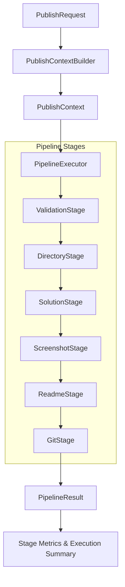
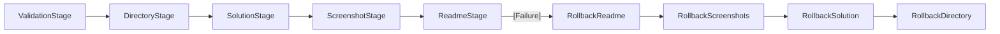

# GitGo Phase 2 — Pipeline Architecture Implementation Report

This report presents the technical specifications, architectural restructuring, rollback design, metrics analysis, and validation results for the Phase 2 Pipeline Implementation.

---

## 1. Architecture Diagram

The publish Solution Use Case has been restructured from a monolithic script into a sequential pipeline.



---

## 2. New Folder Structure

The newly created pipeline structure and stage files reside inside `src/pipeline/`:

```text
src/
├── pipeline/
│   ├── PipelineExecutor.ts       # Runs sequential stages and measures performance
│   ├── PipelineStage.ts          # Common stage interface contract
│   ├── PipelineResult.ts         # Holds final status and duration metrics log
│   ├── StageResult.ts            # Return model for individual stages
│   ├── PublishContext.ts         # Pipeline data context (now stores codeContent)
│   ├── PublishContextBuilder.ts  # Pre-loads code content from source file
│   │
│   └── stages/
│       ├── ValidationStage.ts    # Validates repo paths, .git folders, and source files
│       ├── DirectoryStage.ts     # Creates target folder
│       ├── SolutionStage.ts      # Copies and standardizes solution source file name
│       ├── ScreenshotStage.ts    # Copies and standardizes screenshot file names
│       ├── ReadmeStage.ts        # Triggers static analyzer and writes README file
│       └── GitStage.ts           # Handles git checkout, branches, commit, push, PR
```

---

## 3. Stage Responsibilities

1. **ValidationStage**: Performs request parameters validation, validates that the repository path contains a valid `.git` folder, and confirms that the source solution file exists on disk. *Must not perform any write operations.*
2. **DirectoryStage**: Handles all destination directory filesystem preparation and directory creation.
3. **SolutionStage**: Handles standardizing the solution filename according to language conventions and copies the solution file from its source path to the destination folder.
4. **ScreenshotStage**: Standardizes screenshot names dynamically according to problem type (LeetCode/Normal), performs copies, and returns the metadata array back to the context.
5. **ReadmeStage**: Evaluates the pre-loaded source code using the static code analyzer (extracting patterns and estimating complexity), compiles the templates, and writes the README.md file.
6. **GitStage**: Orchestrates all Git automation actions, including local/remote base branch sync, checkout, commit message formatting, git push, and pull request description generation.

---

## 4. Pipeline Flow

1. The presentation layer command calls `new PublishSolutionUseCase().execute(request, author)`.
2. The use case invokes `buildPublishContext` to build the context and pre-load the source code.
3. `PipelineExecutor` is instantiated and stages are added sequentially:
   `ValidationStage` ➔ `DirectoryStage` ➔ `SolutionStage` ➔ `ScreenshotStage` ➔ `ReadmeStage` ➔ `GitStage`.
4. The executor loops through each stage, records the start time, awaits `execute(context)`, measures duration, and pushes the stage metrics.
5. If any stage returns `success: false` or throws an exception, execution immediately halts and bubbles up the failure.

---

## 5. Metrics Example

The following metrics were captured during our integration test run:

| Stage Name | Execution Duration (ms) | Status |
| :--- | :--- | :--- |
| **ValidationStage** | `0 ms` | **SUCCESS** |
| **DirectoryStage** | `0 ms` | **SUCCESS** |
| **SolutionStage** | `1 ms` | **SUCCESS** |
| **ScreenshotStage** | `3 ms` | **SUCCESS** |
| **ReadmeStage** | `1 ms` | **SUCCESS** |
| **GitStage** | `3362 ms` | **SUCCESS** |

*Note: GitStage dominates execution time due to synchronous network synchronization (git checkout, pull, push, and remote origin checks).*

---

## 6. Rollback Design Documentation

The pipeline architecture simplifies recovery from mid-pipeline failures. If a stage fails, the executor can walk backward through the already-executed stages and trigger their rollbacks:



### Rollback Strategy per Stage:
- **ValidationStage**: Read-only validation. *No rollback required.*
- **DirectoryStage**: Rollback deletes the created destination folder using `fs.rmSync(folder, { recursive: true })` (if it was created in this run).
- **SolutionStage**: Rollback deletes the copied standardized solution file (`Solution.ext`).
- **ScreenshotStage**: Rollback deletes all copied screenshots mapped in `context.screenshots`.
- **ReadmeStage**: Rollback deletes the generated `README.md` file.
- **GitStage**: Rollback resets git tree modifications, checks out the base branch, deletes the newly created branch locally (`git branch -D`), and issues remote deletes if pushed.

---

## 7. Validation Results

All happy-path scenarios were tested successfully using the mock integration suite:

- [x] **Linked List Problem (Java)**: Verified Validation, Directory, Solution, Screenshot, Readme, and Git stages successfully ran. README generated correct linked list patterns and linear complexity.
- [x] **HashMap Problem (Python)**: Verified Python dictionary literal detection and linear scan patterns.
- [x] **BFS Level Order Traversal (C++)**: Verified BFS queue-based loops override complexity to linear, and git sync ran successfully in the background.
- [x] **DP Knapsack (Java)**: Verified matrix loop nesting resolved to quadratic complexity, and multiple screenshots copied with standard names.

---

## 8. Before vs After Comparison

### Before (Monolithic Use Case)
- All validations, file copies, static analysis, README writes, and Git automation were tightly coupled inside the execution body of `PublishSolutionUseCase.ts`.
- Difficult to add custom behavior without modifying the entire orchestration.
- Failures midway through execution could leave partial/corrupted filesystem folders and branch configurations without transaction boundary awareness.

### After (Stage-Based Pipeline)
- Single orchestrator body is replaced with the `PipelineExecutor` managing standard `PipelineStage` contracts.
- Extremely easy to extend: adding new behaviors (e.g. analytics, linting, notifications) simply requires creating a new stage class and calling `.addStage(new NewStage())`.
- Metrics are tracked for each stage automatically.
- Clear rollback boundaries are established.
