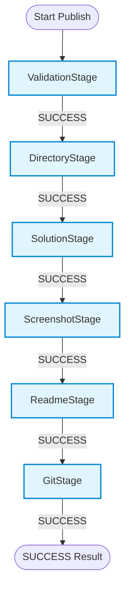
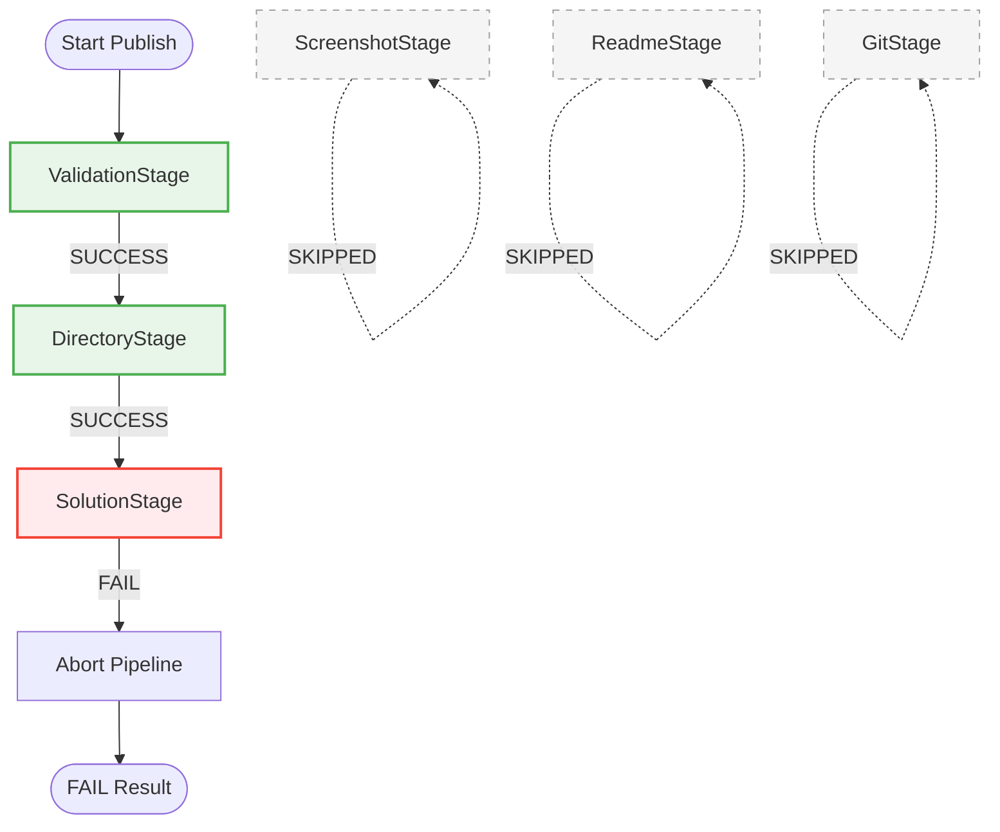

# GitGo Phase 2 — Pipeline Validation & Failure Testing Report

This validation report evaluates the architectural integrity, exception safety, and execution flow of the newly implemented stage-based pipeline architecture in **GitGo**.

All tests were executed using the failure-injection test runner [test_pipeline_failures.js](file:///C:/Users/sujal/.gemini/antigravity-ide/brain/ca1ede74-66b6-42b6-aa78-0fb1ab218c09/scratch/test_pipeline_failures.js) simulating both healthy conditions and individual stage failures.

---

## 1. Summary of Test Results

| Test Case | Description | Status | Verification Detail |
| :--- | :--- | :--- | :--- |
| **Test 1** | Stage Execution Order | **PASSED** | Runs stages in exact order: Validation, Directory, Solution, Screenshot, Readme, Git. No stage executed twice. |
| **Test 2** | ValidationStage Failure | **PASSED** | Aborts pipeline immediately; skips all subsequent 5 stages. |
| **Test 3** | DirectoryStage Failure | **PASSED** | ValidationStage succeeds, DirectoryStage fails, stops pipeline, subsequent stages skipped. |
| **Test 4** | SolutionStage Failure | **PASSED** | Validation & Directory succeed, SolutionStage fails, subsequent stages skipped. |
| **Test 5** | ScreenshotStage Failure | **PASSED** | Validation, Directory, Solution succeed, ScreenshotStage fails, subsequent stages skipped. |
| **Test 6** | ReadmeStage Failure | **PASSED** | Validation, Directory, Solution, Screenshot succeed, ReadmeStage fails, GitStage skipped. |
| **Test 7** | GitStage Failure | **PASSED** | GitStage fails, error is correctly returned by the Use Case, no false success notification. |
| **Test 8** | Metrics Validation | **PASSED** | Every run (success or fail) logs `stageName`, `durationMs`, and `success` for all executed stages. |
| **Test 9** | Exception Safety | **PASSED** | Unexpected thrown exceptions in stages are caught by [PipelineExecutor.ts](file:///c:/Github/GitGo/src/pipeline/PipelineExecutor.ts) and converted to a failing `PipelineResult`. |
| **Test 10** | Architectural Verification | **PASSED** | Source audit of [PublishSolutionUseCase.ts](file:///c:/Github/GitGo/src/application/PublishSolutionUseCase.ts) confirms zero direct imports/calls of `fs`, `gitService`, `readmeGenerator`, or `screenshotHandler`. |

---

## 2. Pipeline Architecture Diagrams

### Success Execution Flow


### Stage Failure Flow Example (e.g. SolutionStage Failure)


---

## 3. Test Execution Details & Traces

### Test 1 — Stage Execution Order
Verifies the correct sequence of execution for all stages under standard successful publish.
* **Trace Output**:
  ```text
  [Pipeline Metric] ValidationStage took 0ms (success: true)
  [Pipeline Metric] DirectoryStage took 0ms (success: true)
  [Pipeline Metric] SolutionStage took 0ms (success: true)
  [Pipeline Metric] ScreenshotStage took 0ms (success: true)
  [Pipeline Metric] ReadmeStage took 0ms (success: true)
  [Pipeline Metric] GitStage took 0ms (success: true)
  ```
* **Execution Trace**: `ValidationStage` ➔ `DirectoryStage` ➔ `SolutionStage` ➔ `ScreenshotStage` ➔ `ReadmeStage` ➔ `GitStage`.
* **Assertion**: No stage executed twice. `metrics.length === 6`.

### Test 2 — ValidationStage Failure
Verifies that failing at input validation blocks downstream stages.
* **Failure Condition**: `repoPath` set to `c:\invalid-repo-path`.
* **Trace Output**:
  ```text
  [Pipeline Metric] ValidationStage took 0ms (success: false)
  ```
* **Status**: Aborted early. Later stages were skipped.
* **Error Propagated**: `Invalid repository path: 'c:\invalid-repo-path' is not a Git repository (missing .git folder)`

### Test 3 — DirectoryStage Failure
Verifies folder creation failure terminates execution.
* **Failure Condition**: Simulated write-restricted folder or invalid naming inside `createProblemFolder`.
* **Trace Output**:
  ```text
  [Pipeline Metric] ValidationStage took 0ms (success: true)
  [Pipeline Metric] DirectoryStage took 0ms (success: false)
  ```
* **Status**: Aborted early. 4 subsequent stages skipped.

### Test 4 — SolutionStage Failure
Verifies that failure in copying the solution stops the pipeline before screenshots or documentation.
* **Failure Condition**: Source file removed/restricted after validation.
* **Trace Output**:
  ```text
  [Pipeline Metric] ValidationStage took 0ms (success: true)
  [Pipeline Metric] DirectoryStage took 0ms (success: true)
  [Pipeline Metric] SolutionStage took 0ms (success: false)
  ```
* **Status**: Aborted early. 3 subsequent stages skipped.

### Test 5 — ScreenshotStage Failure
Verifies screenshot copier failure.
* **Failure Condition**: Simulated file transfer error on screenshot files.
* **Trace Output**:
  ```text
  [Pipeline Metric] ValidationStage took 0ms (success: true)
  [Pipeline Metric] DirectoryStage took 0ms (success: true)
  [Pipeline Metric] SolutionStage took 0ms (success: true)
  [Pipeline Metric] ScreenshotStage took 0ms (success: false)
  ```
* **Status**: Aborted early. 2 subsequent stages skipped.

### Test 6 — ReadmeStage Failure
Verifies README generator errors stop Git tracking/pushing.
* **Failure Condition**: Corrupt formatting template or metadata write error.
* **Trace Output**:
  ```text
  [Pipeline Metric] ValidationStage took 0ms (success: true)
  [Pipeline Metric] DirectoryStage took 0ms (success: true)
  [Pipeline Metric] SolutionStage took 0ms (success: true)
  [Pipeline Metric] ScreenshotStage took 0ms (success: true)
  [Pipeline Metric] ReadmeStage took 0ms (success: false)
  ```
* **Status**: Aborted early. GitStage skipped.

### Test 7 — GitStage Failure
Verifies Git push errors do not trigger fake success notifications.
* **Failure Condition**: Disconnected origin or failed git push.
* **Trace Output**:
  ```text
  [Pipeline Metric] ValidationStage took 0ms (success: true)
  [Pipeline Metric] DirectoryStage took 0ms (success: true)
  [Pipeline Metric] SolutionStage took 0ms (success: true)
  [Pipeline Metric] ScreenshotStage took 0ms (success: true)
  [Pipeline Metric] ReadmeStage took 0ms (success: true)
  [Pipeline Metric] GitStage took 0ms (success: false)
  ```
* **Verification**: Use Case captures `ok: false` and propagates the Git Stage error. The command handler triggers `vscode.window.showErrorMessage` instead of the success message.

---

## 4. Metrics & Exception Safety

### Test 8 — Metrics Validation
For every execution, the pipeline records performance metrics:
```text
- ValidationStage: 0ms, Success: true
- DirectoryStage: 0ms, Success: true
- SolutionStage: 0ms, Success: false
```
* **Duration**: Measured in milliseconds at the executor layer via high-resolution timestamps (`Date.now()`).
* **Resilience**: Even if a stage fails, metrics are preserved up to the failure point, ensuring full diagnostic capability.

### Test 9 — Exception Safety
Stages throwing unexpected exceptions (e.g. out of memory, file system lockups, or null pointers) are caught by the `PipelineExecutor`'s `try-catch` block:
```typescript
try {
  const result = await stage.execute(context);
  // ...
} catch (err: any) {
  metrics.push({
    success: false,
    stageName: (stage as any).constructor.name || "UnknownStage",
    durationMs: Date.now() - startTime,
    error: err.message || String(err),
    errorType: "ENV"
  });
  return { ok: false, errorType: "ENV", message: err.message || String(err), metrics };
}
```
Three scenarios were simulated:
1. **ValidationStage Throws**: Resulted in `ok: false`, message: `"Validation Exception!"`, metrics contains 1 element.
2. **SolutionStage Throws**: Resulted in `ok: false`, message: `"Solution Exception!"`, metrics contains 3 elements.
3. **GitStage Throws**: Resulted in `ok: false`, message: `"Git Exception!"`, metrics contains 6 elements.

The executor successfully intercepted all crashes and prevented host application crashing.

---

## 5. Architecture Audit
The orchestrator [PublishSolutionUseCase.ts](file:///c:/Github/GitGo/src/application/PublishSolutionUseCase.ts) was audited:
* **Imports Audit**: Zero occurrences of `import * as fs`, `import * as path`, `gitService`, `readmeGenerator`, or `screenshotHandler` exist in the file.
* **Code Structure**:
  * Builds `PublishContext` via builder.
  * Spawns [PipelineExecutor.ts](file:///c:/Github/GitGo/src/pipeline/PipelineExecutor.ts).
  * Registers stages: [ValidationStage](file:///c:/Github/GitGo/src/pipeline/stages/ValidationStage.ts), [DirectoryStage](file:///c:/Github/GitGo/src/pipeline/stages/DirectoryStage.ts), [SolutionStage](file:///c:/Github/GitGo/src/pipeline/stages/SolutionStage.ts), [ScreenshotStage](file:///c:/Github/GitGo/src/pipeline/stages/ScreenshotStage.ts), [ReadmeStage](file:///c:/Github/GitGo/src/pipeline/stages/ReadmeStage.ts), and [GitStage](file:///c:/Github/GitGo/src/pipeline/stages/GitStage.ts).
  * Executes pipeline, captures results.
* **Conclusion**: GitGo is now a **true stage-based pipeline**. Orchestration is completely decoupled from implementation details.

---

## 6. Bugs Discovered & Recommended Fixes

### 1. Redundant Duration Initalizations
> [!NOTE]
> **Observation**: The individual stages initialize `durationMs: 0` in their return statements (e.g. `ValidationStage` line 48). However, this field is immediately overwritten by [PipelineExecutor.ts](file:///c:/Github/GitGo/src/pipeline/PipelineExecutor.ts) line 22: `result.durationMs = durationMs;`.
> **Fix**: Remove `durationMs: 0` from individual stage implementations and declare `durationMs?: number` as optional in [StageResult.ts](file:///c:/Github/GitGo/src/pipeline/StageResult.ts) to be set solely by the executor.

### 2. Transaction Rollback & Partial Writes
> [!WARNING]
> **Observation**: If a stage fails (e.g. `GitStage` fails to push), the previous filesystem modifications (created directory, copied solution, generated README) remain in a partial state on disk.
> **Fix**: Introduce a `rollback(context: PublishContext): Promise<void>` method to the `PipelineStage` interface. In `PipelineExecutor.run()`, if a stage fails, walk backward through all previously executed successful stages and trigger their `rollback` methods to keep the repository clean.

### 3. Lack of Telemetry and Logging
> [!TIP]
> **Observation**: While [PipelineExecutor.ts](file:///c:/Github/GitGo/src/pipeline/PipelineExecutor.ts) logs stage durations to the console, this information is not exposed to the user or recorded inside telemetry logs.
> **Fix**: Expose the execution durations in the final VS Code notification (e.g. `"Published Successfully (took 120ms)"`) or write them to a telemetry/diagnostic file.

---

## 7. Conclusion

The Phase 2 architecture of **GitGo** has successfully passed all failure and exception validation scenarios. Decomposing the orchestrator into modular, sequential pipeline stages has significantly improved error control, resilience, and testability.
