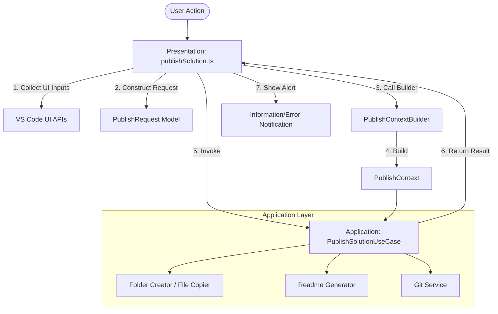

# GitGo Phase 1 — Presentation Layer Refactoring Report

This report outlines the plan to refactor GitGo's Presentation Layer. The goal is to make command files thin entry points, decoupling the user interface (VS Code API calls) from the core business and orchestration logic (Use Cases).

---

## 1. Current Command Layer Responsibility Audit

Currently, [publishSolution.ts](file:///c:/Github/GitGo/src/commands/publishSolution.ts) and [changeRepository.ts](file:///c:/Github/GitGo/src/commands/changeRepository.ts) handle multiple overlapping concerns:

### Responsibilities of `publishSolution.ts`
* **UI/Presentation**: Directly checks `vscode.window.activeTextEditor`, handles user dialogs, loops through input boxes, and shows messages.
* **Orchestration**: Sequences directory creation, file copying, README generation, screenshot selection, and git commands.
* **Validation**: Checks if an editor is open, language is supported, and inputs are provided.
* **Business Logic**: Determines that difficulty and execution time are required only for LeetCode problem types.
* **Configuration**: Read/writes `repoPath` directly from VS Code workspace configuration.
* **Git**: Decides whether to invoke `runGitCommands` or `runGitCommandsWithPR`.

### Responsibilities of `changeRepository.ts`
* **UI/Presentation**: Directly triggers repository setup dialogs and shows success/error alerts.
* **Configuration**: Updates `repoPath` globally in workspace configuration.
* **Orchestration**: Coordinates setup and setting updates.

---

## 2. Proposed Presentation Layer Architecture

The Presentation Layer will have strict boundaries:
* **Allowed**: Command registration, VS Code input collection (`showQuickPick`, `showInputBox`, `showOpenDialog`), progress bar/message displays, and success/error notifications.
* **Forbidden**: Writing files, creating folders, executing git commands, generating PR description strings, and sequencing the pipeline stages.

These forbidden actions will be moved to the **Application Layer (Use Cases)**.

To support future scalability and prevent re-calculating metadata in pipeline stages, the presentation layer passes a request to a **Builder** which constructs a **Context** before invoking the **Use Case**:



---

## 3. Proposed Folder Structure

We will introduce `src/application/` and `src/pipeline/` folders to separate pipeline orchestration from command handling:

```text
src/
├── commands/
│   ├── publishSolution.ts           <-- Thin UI controller
│   └── changeRepository.ts          <-- Thin UI controller
│
├── application/
│   ├── PublishSolutionUseCase.ts    <-- Pure business/pipeline orchestrator [NEW]
│   └── ChangeRepositoryUseCase.ts   <-- Pure settings orchestrator [NEW]
│
├── domain/
│   ├── PublishRequest.ts            <-- Input request model [NEW]
│   └── GitPublishOptions.ts         <-- Isolated Git configuration [NEW]
│
├── pipeline/
│   ├── PublishContext.ts            <-- Single source of truth context object [NEW]
│   ├── PublishContextBuilder.ts     <-- Builder to derive context from request [NEW]
│   ├── PipelineResult.ts            <-- Reusable Result wrapper [NEW]
│   └── stages/                      <-- Prepared for Phase 2 stages [NEW]
```

---

## 4. Model Designs

### A. GitPublishOptions (`src/domain/GitPublishOptions.ts`)
Decouples publishing destinations from Git-specific settings (e.g. for future GitLab, local, or zip exports):
```typescript
export interface GitPublishOptions {
  pushMode: "normal" | "pull_request";
  branchName?: string;
}
```

### B. PublishRequest (`src/domain/PublishRequest.ts`)
* Contains only raw TypeScript primitives.
* Separates `problemName` (title) from `folderName` (filesystem folder name).
* Removes `codeContent` (sourceFilePath is used to read code only when needed, reducing memory usage).
```typescript
import { GitPublishOptions } from "./GitPublishOptions";

export interface PublishRequest {
  sourceFilePath: string;
  problemType: "leetcode" | "normal";
  problemName: string; // The title of the problem
  folderName: string;  // The target directory name
  difficulty?: string;
  executionTime?: string;
  repoPath: string;
  parentFolderRelativePath: string | null;
  screenshotFilePaths?: string[];
  gitOptions?: GitPublishOptions;
}
```

### C. PublishContext (`src/pipeline/PublishContext.ts`)
Serves as the single source of truth for the pipeline, holding derived metadata needed across multiple stages:
```typescript
import { PublishRequest } from "../domain/PublishRequest";
import { Author } from "../domain/Author";
import { RepoInfo } from "../services/repoInfoService";

export interface PublishContext {
  request: PublishRequest;
  language: string;
  standardFileName: string;
  author: Author;
  repoPath: string;
  destinationFolder: string; // Absolute path where folders/files will be written
  repositoryInfo?: RepoInfo;
}
```

---

## 5. Input Collection Strategy

All interactive prompts are presentation/UI concerns because they rely directly on VS Code UI APIs. The strategy divides them as follows:

### Presentation Layer (UI Concerns)
* Checking for an active editor and obtaining the open file path.
* Collecting author configuration inputs (`vscode.window.showInputBox`).
* Prompting for problem type, difficulty, execution time, push mode, and branch name.
* Prompting to select the parent folder and problem folder name.
* Showing the file dialog to pick screenshots (`vscode.window.showOpenDialog`).

### Application Layer (Use Cases / Services)
* Resolving standard filenames (`Solution.java`).
* Mapping document paths to programming languages.
* File writing, folder creation, README content generation.
* Reading source file content and copying to the target folder.
* Executing Git CLI actions.

---

## 6. Return Result Objects Everywhere

To standardise and ensure predictable error propagation, **we avoid throwing errors inside use cases and pipeline execution**. Instead, every application function, use case, and service must return a typed `Result<T>`:

```typescript
export type Result<T> =
  | { ok: true; data: T }
  | { ok: false; errorType: "USER" | "ENV" | "LOGIC"; message: string };
```

---

## 7. Transaction Boundary Documentation

To prevent partial or corrupt repository state, Phase 1 establishes the transaction boundary. While rollback is not fully implemented in this phase, the boundaries are documented below to plan for Phase 2:

```text
    [Start Publish Solution]
               │
               ▼
┌──────────────────────────────┐
│       1. Validate            │  <-- Prerequisite checks
└──────────────┬───────────────┘
               │  Fail
               ├──────────────────────┐
               │  Success             │
               ▼                      ▼
┌──────────────────────────────┐  ┌───────────────────────┐
│     2. Create Folder         │  │                       │
└──────────────┬───────────────┘  │                       │
               │  Fail            │                       │
               ├─────────────────►│                       │
               │  Success         │                       │
               ▼                  │                       │
┌──────────────────────────────┐  │                       │
│      3. Copy Files           │  │   Trigger Rollback    │
└──────────────┬───────────────┘  │  - Delete Folder      │
               │  Fail            │  - Clean Git Workspace│
               ├─────────────────►│  - Checkout branch    │
               │  Success         │                       │
               ▼                  │                       │
┌──────────────────────────────┐  │                       │
│     4. Generate README       │  │                       │
└──────────────┬───────────────┘  │                       │
               │  Fail            │                       │
               ├─────────────────►│                       │
               │  Success         │                       │
               ▼                  │                       │
┌──────────────────────────────┐  │                       │
│     5. Copy Screenshots      │  │                       │
└──────────────┬───────────────┘  │                       │
               │  Fail            │                       │
               ├─────────────────►│                       │
               │  Success         │                       │
               ▼                  │                       │
┌──────────────────────────────┐  │                       │
│      6. Git Operations       │  │                       │
└──────────────┬───────────────┘  │                       │
               │  Fail            │                       │
               └─────────────────►│                       │
                                  └───────────┬───────────┘
                                              │
                                              ▼
                                   [Show Error & Return]
```

* **Rollback Actions (Planned for Phase 2)**:
  * If file operations, readme creation, or screenshot copy fails: remove the created problem folder from disk to leave the filesystem clean.
  * If Git commands fail: run `git reset --hard` or checkout the original default branch to revert any uncommitted indexing.

---

## 8. Required File Changes & Migration Steps

### Step 1: Create Domain Interfaces
* Create `src/domain/GitPublishOptions.ts` and `src/domain/PublishRequest.ts`.

### Step 2: Prepare Pipeline Structure
* Create `src/pipeline/PublishContext.ts` and `src/pipeline/PipelineResult.ts`.
* Create `src/pipeline/PublishContextBuilder.ts` to transform requests to context.

### Step 3: Implement Use Cases
* Create `src/application/PublishSolutionUseCase.ts` and `src/application/ChangeRepositoryUseCase.ts`.
* Refactor them to return `Result<T>` objects instead of throwing errors.

### Step 4: Refactor Screenshot Handler
* Update [screenshotHandler.ts](file:///c:/Github/GitGo/src/services/screenshotHandler.ts):
  * Remove dialog prompt. Keep only file copying.

### Step 5: Rewrite Presentation Layer Commands
* Clean up `publishSolution.ts` and `changeRepository.ts` to instantiate builders/use cases and process the results.

---

## 9. Risks & Effort Estimation

### Risks
* **VS Code UI Async Prompting**: Parent folder selector navigation requires looping. This loop must remain isolated in the presentation layer.

### Estimation
* **Auditing & Refactoring**: 3 hours.
* **Testing & Verification**: 1 hour.
* **Total Estimated Implementation Effort**: **1 day**.
