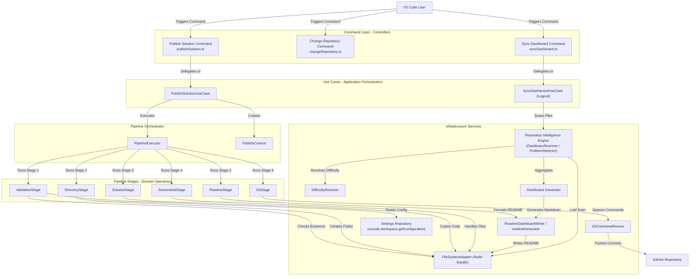
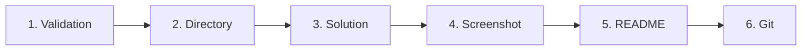
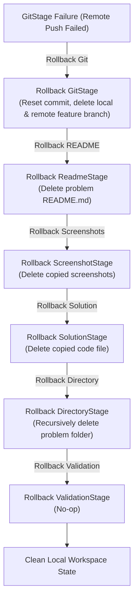
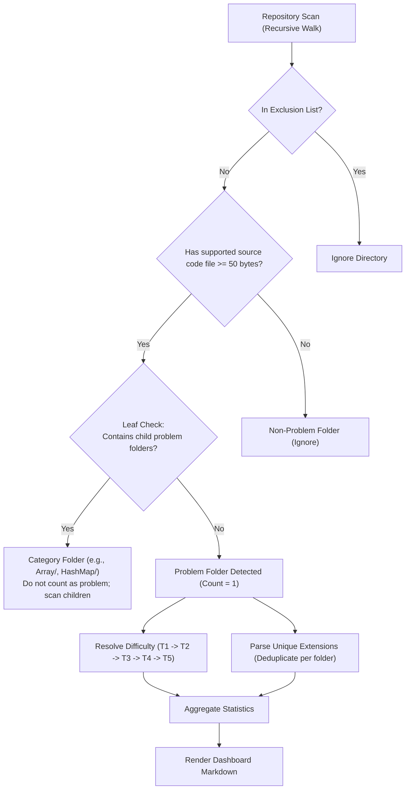
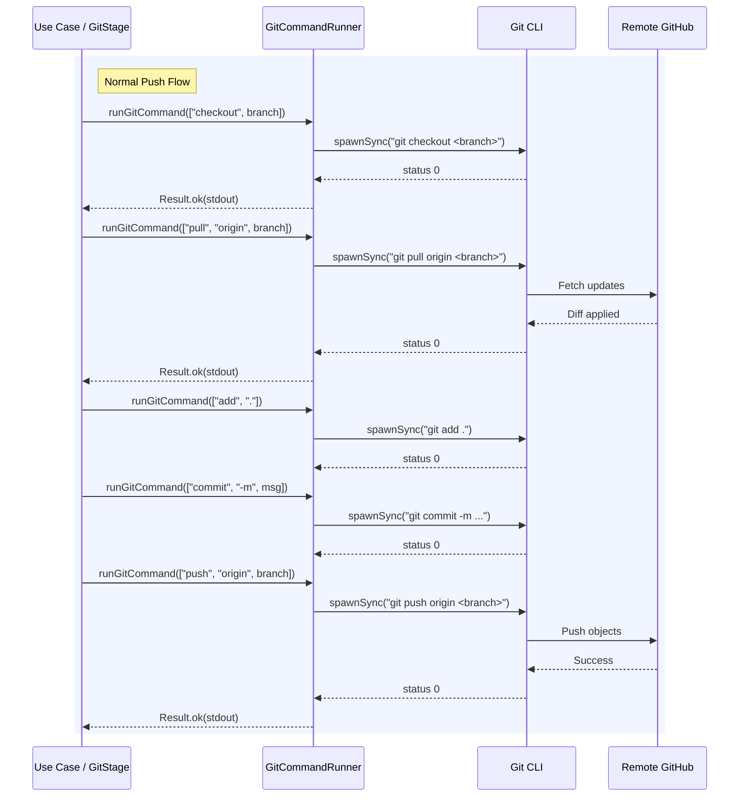
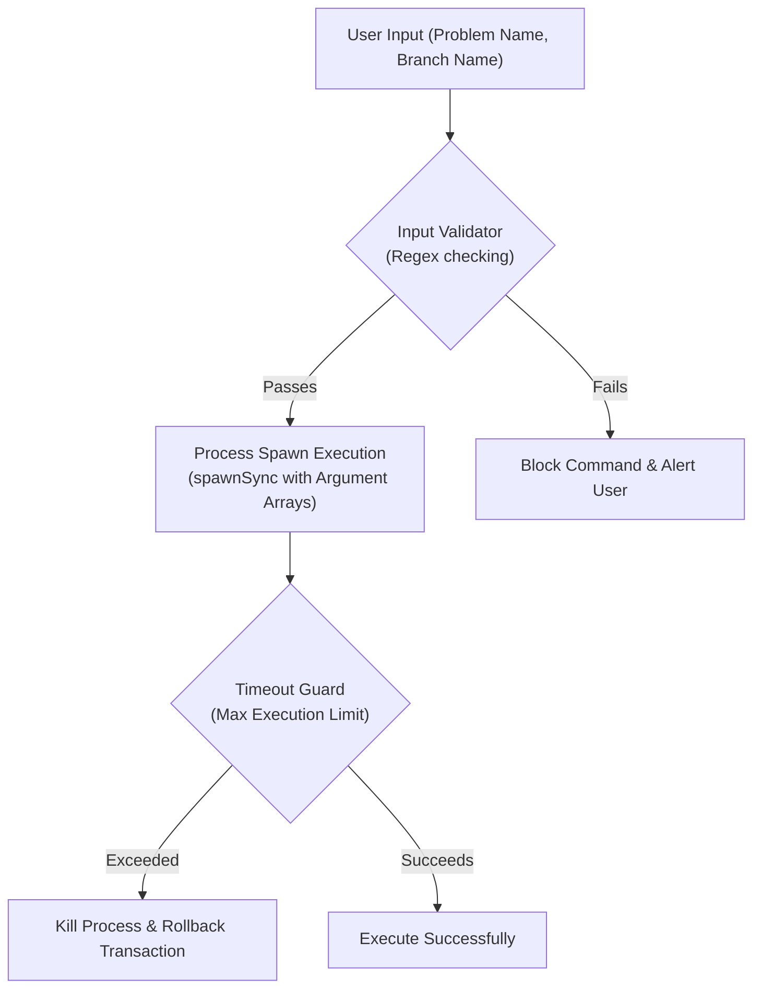

# GitGo System Architecture Documentation

This document serves as the single source of truth for the GitGo architecture. It is designed to provide recruiters, engineers, open-source contributors, and future maintainers with a clear, comprehensive understanding of how GitGo is structured, how data flows through the system, and how the core mechanics are implemented.

---

## Section 1 — High-Level Overview

GitGo is a professional, high-performance VS Code extension designed to streamline the workflow of publishing coding solutions (e.g., LeetCode, HackerRank, or general DSA problems) directly to GitHub. 

### System Overview

```
+-----------------------------------------------------------------------+
|                           VS Code Environment                         |
|                                                                       |
|  +--------------------+      +-------------------------------------+  |
|  |   Command Layer    | ---> |        Use Case Orchestration       |  |
|  | (publishSolution)  |      |      (PublishSolutionUseCase)       |  |
|  +--------------------+      +-------------------------------------+  |
|                                                 |                     |
|                                                 v                     |
|                              +-------------------------------------+  |
|                              |          Pipeline Orchestrator      |  |
|                              |          (PipelineExecutor)         |  |
|                              +-------------------------------------+  |
+-------------------------------------------------|---------------------+
                                                  |
                                                  v
                               +-------------------------------------+
                               |           Pipeline Stages           |
                               |  (Validation -> Dir -> Sol -> ...)  |
                               +-------------------------------------+
                                                  |
                                                  v
                               +-------------------------------------+
                               |       Infrastructure Services       |
                               | (GitCommandRunner, FileSystem, ...) |
                               +-------------------------------------+
                                                  |
                                                  v
                               +-------------------------------------+
                               |          GitHub Repository          |
                               +-------------------------------------+
```

* **VS Code Extension UI:** The user triggers publishing, repository changes, or dashboard synchronizations directly from the VS Code Command Palette or editor context. The extension utilizes quick-picks and input boxes for zero-friction setup.
* **One-Command Publishing Workflow:** Users can publish the active solution file to their repository in a single command. The extension automatically detects the language, prompts for metadata (problem type, difficulty, execution time), moves/copies the files, generates a clean documentation README, commits the files, and pushes them to GitHub.
* **Transactional Architecture:** Publishing operations are executed inside a pipeline. If any stage fails (e.g., a Git push fails due to network issues), the system initiates a reverse-order rollback, restoring the local filesystem and Git index to their original states to guarantee zero repository corruption.
* **Repository Intelligence:** The extension automatically scans the repository using a source-code-first leaf folder classification algorithm. It detects solved problems, language usage, and difficulty levels, completely bypassing folder structures that do not represent solution folders.
* **Dashboard Synchronization:** A progress dashboard is compiled from the scanned repository metadata and written to the repository's `README.md` inside a dedicated, marker-guarded block. This dashboard features dynamic badge generation and zero-value suppression for a clean aesthetic.

---

## Section 2 — Complete System Architecture Diagram

The diagram below details the entire GitGo system architecture, mapping user interactions through the controller, application use case, pipeline orchestrator, stages, and low-level infrastructure layers.



---

## Section 3 — Publish Pipeline

The publish pipeline is executed sequentially. Each stage performs a single responsibility, operating on a shared, stateful [PublishContext](file:///c:/Github/GitGo/src/pipeline/PublishContext.ts).

### Stage Execution Flow



### Stage Responsibilities, Inputs, and Outputs

| Stage | Responsibility | Primary Inputs | Primary Outputs / Side Effects |
| :--- | :--- | :--- | :--- |
| **ValidationStage** | Validates the user configurations, checks if the active document exists, and ensures input problem and branch names do not violate security patterns. | `request.repoPath`, `request.sourceFilePath`, `request.problemName`, `request.gitOptions` | Throws validation error if criteria are not met. |
| **DirectoryStage** | Creates the destination folder for the problem within the target directory path. | `request.folderName`, `request.parentFolderRelativePath` | Creates the directory on disk. Sets `context.createdDirectory = true` and resolves `context.destinationFolder`. |
| **SolutionStage** | Copies the active code file to the destination folder under a standardized name. | `request.sourceFilePath`, `context.destinationFolder`, `context.language` | Copies file to disk. Resolves `context.standardFileName`. |
| **ScreenshotStage** | Validates, renames, and moves the screenshots to the destination folder. | `request.screenshotFilePaths`, `context.destinationFolder`, `request.problemType` | Renames screenshots to `testcases.png` (and/or `submission.png`) and writes to disk. Populates `context.screenshots`. |
| **ReadmeStage** | Generates a clean, emoji-free markdown file describing the problem metadata, repository contents, screenshots, and author details. | `context.destinationFolder`, `request.problemName`, `context.language`, `context.codeContent`, `context.screenshots` | Writes `README.md` inside the destination folder. Sets `context.createdReadme = true`. |
| **GitStage** | Checks out branches, pulls remote updates, stages changes, commits, and pushes them to the remote GitHub repository. | `context.repoPath`, `request.problemName`, `request.gitOptions` | Local index committed, remote branch created/pushed, PR templates copied to clipboard and compare page opened in browser. Sets `context.commitHash` and `context.branchPushed`. |

---

## Section 4 — Transactional Rollback System

Publishing involves filesystem modifications and network-bound Git executions. To maintain a clean workspace, GitGo provides a strict transactional safety system controlled by the [PipelineExecutor](file:///c:/Github/GitGo/src/pipeline/PipelineExecutor.ts). 

### Rollback Flow

If a stage execution fails, the executor halts the forward pipeline and rolls back all previously completed stages in **reverse order**.



### Consistency Guarantees

* **Atomic Publishing:** The workspace remains completely untouched unless all local file stages succeed. If Git operations fail, the repository state is restored exactly to the initial pre-publish commit.
* **Reverse-Order Rollback:** Cleanup is executed in exact reverse order of creation. This prevents dangling pointers or attempts to delete files whose parent directories have already been destroyed.
* **Fault-Tolerant Cleanup:** If an exception occurs during the rollback of a specific stage (e.g., disk lock preventing a file deletion), the executor logs the warning, isolates the crash, and continues executing subsequent stage rollbacks to ensure maximum possible cleanup.

---

## Section 5 — Repository Intelligence Architecture

The Repository Intelligence module is designed to map the structure of coding repositories without requiring pre-existing index files or metadata databases.

### Key Classification Pillars

1. **Source-Code-First Detection:** Source code files are treated as the primary signal. A directory is only classified as a solved problem if it contains a supported source file of size $\ge 50$ bytes (preventing empty boilerplate templates from matching). README files are entirely optional.
2. **Leaf Folder Classification (Leaf Folder Rule):** A folder is classified as a solved problem if it contains supported source code and does not contain any subdirectories that are themselves classified as problem folders.
   $$\text{Problem Folder} = \text{Contains Supported Source Code} \land \neg(\text{Contains Child Problem Folders})$$
3. **Folder Exclusion System:** High-traffic directories containing build artifacts, configurations, or dependencies are blacklisted to avoid scanning overhead. Ignored patterns include:
   `["templates", "utils", "boilerplate", "notes", "assets", "doc", "docs", "test", "tests", "debug", "scripts", ".git", ".github", ".vscode", "node_modules", "out", "dist", "venv", "bin", "obj"]`
4. **Multi-Language Handling:** If a problem folder contains multiple solutions (e.g., `Solution.java`, `solution.py`), GitGo counts it as **one solved problem** but increments individual language counts for each unique language extension detected.
5. **Difficulty Resolution Fallback (T1-T5):**
   * **T1 (README Metadata Table):** Read `README.md` and parse table rows for difficulty.
   * **T2 (Folder Path Matching):** Inspect parent folder segments for keywords like `/easy/`, `/medium/`, `/hard/`.
   * **T3 (Inline Code Comments):** Scan the first 30 lines of source code for annotations (e.g., `@difficulty: Easy` or `difficulty = Medium`).
   * **T4 (Folder Name Parsing):** Check if the folder name contains suffix/prefix difficulty strings (e.g., `231-Power-of-Two-Easy`).
   * **T5 (Default Fallback):** Categorized as `Unclassified`.

### Scan & Aggregation Flow



---

## Section 6 — Dashboard Synchronization

GitGo's Progress Dashboard renders progress statistics dynamically and synchronizes them with the project's root `README.md` (or the `LeetCode/README.md` subdirectory if a nested LeetCode workspace is detected).

### Dashboard Rules

* **README Marker System:** The dashboard is enclosed between two markers:
  `<!-- GITGO_DASHBOARD_START -->` and `<!-- GITGO_DASHBOARD_END -->`. This keeps user-written content safe from override.
* **Badge Generation:** Renders SVG badges using Shields.io matching the count of problems, difficulties (success green, orange, red), and languages (color-coded).
* **Zero-Value Suppression:** Only languages and difficulty buckets with counts $\ge 1$ are generated. If a language has 0 solved problems, it is suppressed from the badges, tables, and lists.

### Synchronization Cases

* **Case A (Markers Exist):** The generator scans the README, locates the markers via regular expressions, replaces all content between the markers, and writes back the updated file.
* **Case B (README Exists, Markers Missing):** The generator appends the dashboard (wrapped in markers) to the bottom of the existing README file.
* **Case C (README Missing):** The generator creates a new `README.md` file, writes the dashboard to it, and saves it.

### Synchronize Workflow

```mermaid
graph TD
    Sync["Sync Dashboard Triggered"]
    ScanRepo["Scan Repository & Gather Statistics"]
    GenMD["Generate Dashboard Markdown with Zero-Value Suppression"]
    CheckReadme{"Does README.md exist?"}
    
    Sync --> ScanRepo --> GenMD --> CheckReadme
    
    CheckReadme -->|No| CaseC["Case C:<br>Create new README.md with wrapped dashboard content"]
    CheckReadme -->|Yes| CheckMarkers{"Do markers exist in README?"}
    
    CheckMarkers -->|Yes| CaseA["Case A:<br>Replace text between markers with new dashboard"]
    CheckMarkers -->|No| CaseB["Case B:<br>Append wrapped dashboard to bottom of README"]
    
    CaseC --> WriteDisk["Write to README.md on Disk"]
    CaseA --> WriteDisk
    CaseB --> WriteDisk
```



---

## Section 7 — Git Integration Layer

The Git Integration layer abstracts Git operations behind a structured API, translating higher-level application actions into clean, process-isolated Git commands.

### Key Components

* **GitCommandRunner:** A shell-less runner executing the Git binary via Node `spawnSync` with piped streams. This prevents terminal flashes on Windows (`windowsHide: true`), provides error stream translation, and handles execution timeouts.
* **Branch Detection:** Automatically queries the default branch (e.g., `main`, `master`, or `develop`) by reading `refs/remotes/origin/HEAD`, falling back to local branch evaluations.
* **Push Workflow:** Performs a pull-before-push merge strategy to avoid remote rejection conflicts.
* **Pull Request Workflow:** Creates a fresh branch from the default branch, commits the files, pushes the feature branch to `origin`, copies a structured Markdown pull request template to the clipboard, and launches the comparison page URL in the default browser.

### Git Transaction Diagram



---

## Section 8 — Security Architecture

GitGo is built to prevent common extension security issues, such as shell command injection, unauthorized file access, and runaway background processes.



### Security Safeguards

* **Input Validation:** Problem names and branch names are validated using strict regular expressions in [inputValidator.ts](file:///c:/Github/GitGo/src/services/inputValidator.ts). Problem names must not contain special character strings (`"`, `'`, `&`, `|`, `>`, `<`, `;`). Branch names must not contain spaces or Git invalid branch characters (`:`, `~`, `^`, `?`, `*`, `[`, `\`, `@{`, `..`).
* **Argument-Based Git Execution:** Git commands are executed as discrete argument arrays instead of a single compiled command string. For example, instead of running `git commit -m "msg"`, GitGo spawns `git` and passes `["commit", "-m", "msg"]` directly.
* **No Shell Interpolation:** By using `spawnSync` without the `shell` option, the operating system executes the Git process directly. This makes it impossible for attackers to append malicious command chains (e.g., `Two Sum"; rm -rf /;`) as the arguments are never processed by a shell interpreter (cmd.exe or bash).
* **Timeout Protection:** Every external process invocation is guarded with a timeout configuration (`10000ms` for local operations, `60000ms` for remote operations). If a Git command hangs due to ssh prompt blocks or bad network routing, Node kills the process to prevent CPU pinning.

---

## Section 9 — Performance Characteristics

GitGo is designed for linear performance scaling ($O(N)$), enabling fast workspace parsing even for repositories with thousands of solved problems.

### Repository Scanning Performance Benchmarks

The table below lists the performance profiles measured across different LeetCode structure sizes (containing up to 20,000 solution and documentation files).

| Repo Size (Problems) | Total Scan Time (ms) | Problem Detection (ms) | Difficulty Classify (ms) | Language Classify (ms) | Dashboard Gen (ms) | README Update (ms) |
| :--- | :--- | :--- | :--- | :--- | :--- | :--- |
| **100** | 21.46 | 11.84 | 2.61 | 7.00 | 0.78 | 0.57 |
| **500** | 78.54 | 46.22 | 8.45 | 23.88 | 0.38 | 0.87 |
| **1000** | 283.63 | 161.70 | 33.38 | 88.55 | 0.36 | 0.88 |
| **2500** | 630.80 | 370.00 | 72.19 | 188.62 | 1.78 | 2.51 |
| **5000** | 1180.75 | 675.27 | 137.18 | 368.29 | 1.53 | 1.05 |
| **10000** | **2288.90** | 1318.00 | 262.71 | 708.19 | 2.47 | 0.78 |

* **Linear Scaling Verification:** Repository scanning scales linearly. For 10,000 problems, scanning completes in **under 2.29 seconds**, allowing GitGo to achieve a scanning throughput exceeding **1,200 problems/second**.
* **Dashboard Writing Benchmarks:**
  * Dashboard creation time (No README): `0.78 ms`
  * Dashboard update time (Exists README): `0.45 ms`
  * Marker replacement time (Regex & Disk Write): `0.29 ms`
* **Memory and Stress Profiles:** Under continuous operations (100 sequential updates), memory heap growth is capped at `0.531 MB` with zero dashboard block duplication or file corruption.

---

## Section 10 — Design Principles

GitGo adheres to clear software engineering principles to remain maintainable, extensible, and robust.

* **Single Responsibility Principle (SRP):** Classes and functions do one thing. For example, commands handle VS Code UI inputs; Use Cases coordinate overall actions; Stages contain the execution/rollback logic of a single pipeline step; Services handle low-level infrastructure tasks.
* **Separation of Concerns (SoC):** Distinct separation is maintained between the VS Code Editor Layer (UI/QuickPicks), the Application Orchestration Layer (Use Cases), the Pipeline Domain Layer (Stages/Executor), and the Infrastructure Layer (GitCommandRunner, fs).
* **Pipeline Architecture:** Solves the problem of monolithic, un-testable scripts. By breaking publishing into validation, file creation, and Git steps, stages can be developed, tested, and timed independently.
* **Transactional Consistency:** Ensures the repository never ends up in a half-written state. Local and remote transactions are rolled back atomically in reverse order on failure.
* **Deterministic Execution:** Functions like `resolveDifficulty` and `detectLanguage` are deterministic, producing predictable outputs for identical repository states.
* **Infrastructure Abstraction:** Core application logic is isolated from Node filesystem and process APIs, allowing adapters (like `GitCommandRunner`) to handle safety parameters such as error translation and process timeouts.

---

## Section 11 — Project Structure

### Directory Tree

```
src/
├── application/           # Application use cases & orchestration
├── benchmark/             # Performance benchmarking tests & reporting
├── commands/              # VS Code command controllers & UI logic
├── domain/                # Shared enterprise core entities & interfaces
├── pipeline/              # Pipeline stage orchestrator & execution flow
│   └── stages/            # Atomically rollable publishing stages
├── services/              # Common business utilities & infrastructure adapters
│   ├── dashboard/         # Repository scanning, difficulty resolution & dashboard formatting
│   └── git/               # Low-level shell-less Git client execution
├── templates/             # Markdown template definitions for README generation
├── test/                  # Automated unit and integration test suites
└── types/                 # Static TypeScript type definitions & enums
```

### Folder Responsibilities

* [application](file:///c:/Github/GitGo/src/application): Houses use cases that act as direct executors of business actions. They orchestrate domain objects and pipeline execution.
* [benchmark](file:///c:/Github/GitGo/src/benchmark): Contains the benchmarking suite used to validate extension throughput, scaling limits, and memory characteristics.
* [commands](file:///c:/Github/GitGo/src/commands): Thin VS Code command controllers. They handle editor verification, show input prompts/quick-picks, validate metadata constraints, and forward the request to the application layer.
* [domain](file:///c:/Github/GitGo/src/domain): Defines shared core business definitions, including domain types like `Author`, `Result`, and context interfaces.
* [pipeline](file:///c:/Github/GitGo/src/pipeline): Houses the pipeline engine, containing the `PipelineExecutor` orchestrator, rollback controls, and abstract stage classes.
* [pipeline/stages](file:///c:/Github/GitGo/src/pipeline/stages): Contains the concrete publishing steps (`ValidationStage`, `DirectoryStage`, etc.).
* [services](file:///c:/Github/GitGo/src/services): Reusable business services. Handles actions like file copies, path resolutions, and user profile management.
* [services/dashboard](file:///c:/Github/GitGo/src/services/dashboard): Centralizes the repository intelligence features, containing scanner, classification, difficulty resolver, and markdown formatting modules.
* [services/git](file:///c:/Github/GitGo/src/services/git): Handles low-level process spawner execution and security wrappers.
* [templates](file:///c:/Github/GitGo/src/templates): Stores structured README layouts for general and platform-specific solution folders.
* [test](file:///c:/Github/GitGo/src/test): Automated test suites verifying use cases, rollback atomicity, and scanning accuracy.
* [types](file:///c:/Github/GitGo/src/types): System-wide type contracts and enums (e.g., `pushMode`, `problemType`).
