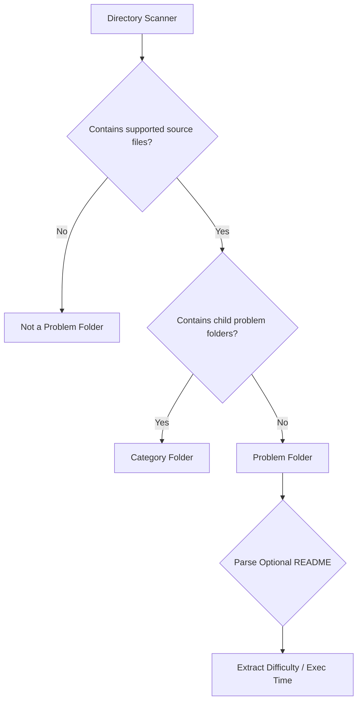

# GitGo Phase 5 — Repository Intelligence Architecture Design (Revised)

This document specifies the technical architecture and design for the **GitGo Progress Dashboard & Repository Intelligence** system (Phase 5). 

---

## 1. Problem Detection Architecture

In this revised architecture, **Source Code is the Primary Signal**, and **README files are Optional Metadata**. README files provide supplementary metadata (e.g. difficulty, description, execution times), but their presence is never required to classify a folder as a solved problem.



---

## 2. Leaf Folder Detection Strategy

The primary detection algorithm is based on the **Leaf Folder Rule**:

$$\text{Problem Folder} = \text{Contains Supported Source Code} \land \neg(\text{Contains Child Problem Folders})$$

### Leaf Folder Classification Algorithm

```text
Function ClassifyDirectory(dirPath, trackedFolders, exclusions):
    If dirPath in exclusions:
        Return "EXCLUDED"

    Let subdirs = GetSubdirectories(dirPath)
    Let files = GetFiles(dirPath)
    
    // Step 1: Detect supported source code files
    Let sourceFiles = files.filter(f => HasSourceExtension(f))
    If sourceFiles.length == 0:
        Return "NOT_A_PROBLEM"
        
    // Step 2: Recursively check subdirectories
    Let problemSubdirs = []
    For each subdir in subdirs:
        If ClassifyDirectory(subdir, trackedFolders, exclusions) == "PROBLEM":
            problemSubdirs.push(subdir)
            
    // Step 3: Leaf check
    If problemSubdirs.length == 0:
        Return "PROBLEM"
    Else:
        Return "CATEGORY"
```

### Analysis of Case Examples

* **Example A: `Two Sum / Solution.java`**
  * Contains source file `Solution.java`.
  * Has no subdirectories containing problem files.
  * ➔ **Classified as Problem Folder**.
* **Example B: `Two Sum / Solution.java, Solution.py, Solution.cpp`**
  * Contains source files.
  * Has no subdirectories containing problem files.
  * ➔ **Classified as Problem Folder** (1 solved problem with 3 languages).
* **Example C: `Array / Two Sum / Solution.java` and `Array / Contains Duplicate / Solution.java`**
  * `Two Sum` and `Contains Duplicate` contain source files and no problem subdirs. ➔ **Classified as Problem Folders**.
  * `Array` contains subfolders that are classified as problem folders. ➔ **Classified as Category Folder** (not counted as solved).
* **Example D: `LeetCode / Easy / Array / Two Sum / Solution.java`**
  * `Two Sum` ➔ **Classified as Problem Folder**.
  * `LeetCode`, `Easy`, and `Array` all contain problem subdirectories. ➔ **Classified as Category Folders**.
* **Example E: `Codeforces / 71A Way Too Long Words / solution.cpp`**
  * `71A Way Too Long Words` contains `solution.cpp` and no problem subdirs. ➔ **Classified as Problem Folder**.
  * `Codeforces` contains problem subdirectories. ➔ **Classified as Category Folder**.

---

## 3. Category Folder Classification

Folders such as `Array`, `HashMap`, `Tree`, `Graph`, `DP`, and `Backtracking` must not be counted as solved problems.
* **Subdirectory Check**: Any folder that contains at least one subdirectory classified as a `PROBLEM` folder is automatically designated as a `CATEGORY` folder.
* **Name-Based Matching**: Common category names matching a predefined list are explicitly blocked from being classified as `PROBLEM` folders even if they contain stray files.

---

## 4. Multi-Language Solutions

When a problem folder contains multiple source files in different languages, GitGo counts it as one solved problem while incrementing the statistics for each language.

### Mapping Logic
* **Problems Solved**: $+1$ (counted once per problem folder).
* **Language breakdown**:
  * Traverse all files in the folder.
  * Extract unique extensions of supported languages (e.g. `.java` ➔ Java, `.py` ➔ Python, `.cpp` ➔ C++).
  * Increment the counter for each detected language by $1$.

### Metric Output Example
For folder `Two Sum/` containing `Solution.java`, `Solution.py`, and `Solution.cpp`:
* Total Problems Solved: 1
* Java: 1
* Python: 1
* C++: 1

---

## 5. False Positive Prevention

DSA repositories often contain notes, templates, utilities, and boilerplate code that should not be counted as solved problems.

### Mitigation Strategies

1. **Folder Name Blocklist (Exclusions)**:
   Explicitly ignore folders matching:
   `["templates", "utils", "boilerplate", "notes", "assets", "doc", "docs", "test", "tests", "debug", "scripts", ".git", ".github", ".vscode", "node_modules", "out", "dist"]`
2. **File Size Filters**:
   Ignore source files under $50$ bytes to filter out empty templates.
3. **Workspace Inclusions (`trackedFolders`)**:
   Enforce tracking only within folders configured in VS Code workspace settings.
4. **Filename Exclusions**:
   Ignore common utility filenames (e.g. `FastIO.java`, `Template.cpp`, `Boilerplate.java`, `Main.java` if it is the only file inside a folder named `boilerplate`).

---

## 6. Difficulty Resolution Impact

Difficulty resolution follows a source-code-first fallback hierarchy:

```text
1. README Metadata Table (T1) -> If README exists, parse table.
2. Folder Path Matching (T2) -> If parent path contains '/easy/', '/medium/', '/hard/', map difficulty.
3. Inline Code Comments (T3) -> Scan top 30 lines of source code for comments like `Difficulty: Easy` or `Difficulty - Medium`.
4. Folder Name Parsing (T4) -> If folder name matches `*-Easy`, `*-Medium`, `*-Hard`.
5. Default Fallback (T5) -> Count as 'Unclassified'.
```

---

## 7. Dynamic Dashboard Rendering Rules

To keep the dashboard clean, professional, and strictly data-driven, rendering follows a **Zero-Value Suppression** strategy. No sections or counters showing values of zero are generated.

### Zero-Value Suppression Rules

1. **Language Section**:
   * Supported DSA Languages & Extensions:
     * `.java` ➔ Java
     * `.cpp`, `.cc`, `.cxx` ➔ C++
     * `.c` ➔ C
     * `.py` ➔ Python
     * `.js` ➔ JavaScript
     * `.ts` ➔ TypeScript
     * `.go` ➔ Go
     * `.cs` ➔ C#
     * `.kt` ➔ Kotlin
     * `.rs` ➔ Rust
   * Only languages with counts $C \ge 1$ are rendered. Languages with $0$ counts are omitted entirely.
   * If all language counts are $0$, the entire `Languages:` block and header are omitted from the markdown.

2. **Difficulty Distribution**:
   * Only difficulty buckets (`Easy`, `Medium`, `Hard`, `Unclassified`) with counts $C \ge 1$ are rendered.
   * Buckets with $0$ counts are omitted.

3. **Empty Sections**:
   * If any dashboard section contains no data, it is not rendered at all.

---

## 8. Dashboard Mockups

### Example A: Single Language (Only Java Problems)
```markdown
## Progress Dashboard

Total Problems: 147

Easy: 62
Medium: 71
Hard: 14

Languages:
- Java: 147

Last Updated:
2026-06-11
```

### Example B: Multi-Language (Java, Python, C++ Problems)
```markdown
## Progress Dashboard

Total Problems: 200

Easy: 80
Medium: 90
Hard: 20

Languages:
- Java: 120
- Python: 50
- C++: 30

Last Updated:
2026-06-11
```

### Example C: Unclassified Problems (Only Unclassified, Java)
```markdown
## Progress Dashboard

Total Problems: 25

Unclassified: 25

Languages:
- Java: 25

Last Updated:
2026-06-11
```

---

## 9. Scalability Review & Caching

Disk activity during scanning:
* **100 problems**: Direct scans take ~20ms.
* **500 problems**: Direct scans take ~100ms.
* **1,000 problems**: Direct scans take ~300ms.
* **5,000 problems**: Direct scans take ~2.0 seconds.

### Caching Strategy
Caching is **mandatory** for repositories containing more than 500 problems to prevent VS Code UI freezing:
* **JSON Cache (`.gitgo/metadata.json`)**: Stores the cached metadata of problem folders.
* **Incremental Scans**: On publish, GitGo only scans the newly created problem folder and merges its data into the cache. This operation runs in **<5 milliseconds**.
* **Background Sync**: Runs a differential file modification scan upon extension activation or Git HEAD changes, comparing directory timestamps against the JSON cache to only re-scan modified folders.

---

## 10. Final Architecture Recommendation

We recommend adopting the revised **Source-Code-First Leaf Folder Detection** architecture with **Dynamic Dashboard Rendering**. It is resilient, does not force users to maintain README files, and suppresses zero-value rows cleanly.

```text
APPROVED FOR PHASE 5 DEVELOPMENT WITH REVISED SPECIFICATION
```
